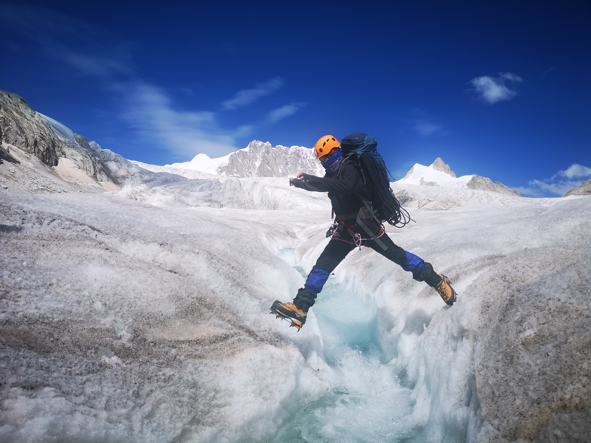

## Hi there, it's Jerry Qilong Wu~ Nice to Meet you! 👋
<!--
**JerryWu-code/JerryWu-code** is a ✨ _special_ ✨ repository because its `README.md` (this file) appears on your GitHub profile.
Here are some ideas to get you started:
-->
- 🔭 I’m Jerry Qilong Wu, currently an upcoming graduate MSc student at National University of Singapore, focusing on Statistics and Computing. Previously, I held a Bachelor Degree of Physics.
- 🏠 I am deeply grateful to [Prof. Weiji](https://jiwei0523.github.io/) and [Prof. Roger Zimmermann](https://scholar.google.com.tw/citations?user=IDREwXEAAAAJ) from [NUS](https://www.nus.edu.sg/) for guiding me into the field of **AI research starting from September 2023**. Also, I am very fortunate to have been mentored by [Dr. Zongwei Zhou](https://www.zongweiz.com/) and Bloomberg Distinguished [Prof. Alan L. Yuille](https://www.cs.jhu.edu/~ayuille/) at [CCVL](https://ccvl.jhu.edu/) research group in [JHU](https://www.jhu.edu/). And I am so luckily to spent great time with [Prof. Bharadwaj Veeravalli](https://scholar.google.com/citations?user=IqAJttsAAAAJ&hl=en)@NUS, [Prof. Song Bai](https://songbai.site/)@NUS&ByteDance, [Dr. Haoxin Li](https://lihaoxin05.github.io/)@NTU, [Prof. Sun Chenshuo](https://www.comp.nus.edu.sg/disa/people/csun/)@NUS and [Dr. Shansong Liu](https://scholar.google.com/citations?user=ndVYtaUAAAAJ&hl=zh-CN)@Meituan.
- 🌱 I’m currently learning Statistics Intrinsic Theory about current popular models, like Diffusion (Like nice papers of [Yang Song](https://yang-song.net/)), LLMs (How the reasoning and memorizing ability emerges, like [Attention Sink](https://arxiv.org/pdf/2309.17453) and [CoT](https://arxiv.org/pdf/2201.11903), and how it contributes to other modality, like [LLMs Represent Space & Time](https://arxiv.org/pdf/2310.02207)), and How Different Modality Interactive with each other (Vision, Audio and Lanugage etc., Like [The Platonic Representations](https://arxiv.org/pdf/2405.07987), and how we Integrate Physic Laws into Neural Networks Applications (Like [PhysGen: Rigid-Body Physics-Grounded Image-to-Video Generation](https://arxiv.org/pdf/2409.18964)).
- 🧐 **Over the past one year**, I've made AI paper submissions to **CVPR 2025**, **ICLR 2025**, **NAACL 2025**, **AAAI 2025** and **ISBI 2025** and currently they are under review. And in my spare time, I serve as reviewer for **ACM MM 2024**, **NeurlPS 2024**, **AISTATS 2025**, **ICLR 2025**.
- 🤔 **I’m always actively looking for CS PhD positions starting from 2025 Fall or 2026 Spring about Multimodal Learning, Computer Vision or Mathematics Theory behind CV or LLMs~~ And I'm also looking for full-time contract Research Assitant start from early 2025~~**
- 📫 How to reach me: Feel free to drop an email to [qilong_wu@u.nus.edu](qilong_wu@u.nus.edu) or [jerrywu27705751@gmail.com](jerrywu27705751@gmail.com) 📩 ~
- ⚡ Fun fact: I was a **Mountaineer Athlete** before, and have summitted the First Peak of Mount Siguniang (**5,038m**) and the main peak of Que’er Mountain (**6,168m**) in Ganzi Tibetan Autonomous Prefecture, Sichuan, China **in 2019**  [news](http://bbs.lvye.cn/thread-2635578-1-1.html).

  
  

<picture>
  <source media="(prefers-color-scheme: dark)" srcset="https://raw.githubusercontent.com/JerryWu-code/JerryWu-code/output/contribution-snake-dark.svg">
  <source media="(prefers-color-scheme: light)" srcset="https://raw.githubusercontent.com/JerryWu-code/JerryWu-code/output/contribution-snake.svg">
  
</picture>

    

