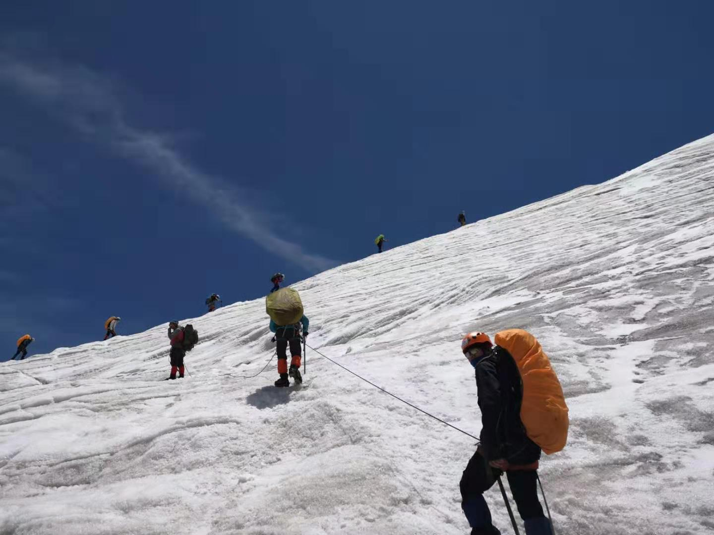

## Hi there, it's Jerry Qilong Wu~ Nice to Meet you! 👋
- Interested in LLMs, Multimodal Generation, as well Theoretical Part. A beginer always happy to learn from great community.
<!--
- learning Statistics Intrinsic Theory about current popular models, like Diffusion (Like nice papers of [Yang Song](https://yang-song.net/)), LLMs (How the reasoning and memorizing ability emerges, like [Attention Sink](https://arxiv.org/pdf/2309.17453) and [CoT](https://arxiv.org/pdf/2201.11903), and how it contributes to other modality, like [LLMs Represent Space & Time](https://arxiv.org/pdf/2310.02207)), and How Different Modality Interactive with each other (Vision, Audio and Lanugage etc., Like [The Platonic Representations](https://arxiv.org/pdf/2405.07987), and how we Integrate Physic Laws into Neural Networks Applications (Like [PhysGen: Rigid-Body Physics-Grounded Image-to-Video Generation](https://arxiv.org/pdf/2409.18964)).
-->

  
  

<picture>
  <source media="(prefers-color-scheme: dark)" srcset="https://raw.githubusercontent.com/JerryWu-code/JerryWu-code/output/contribution-snake-dark.svg">
  <source media="(prefers-color-scheme: light)" srcset="https://raw.githubusercontent.com/JerryWu-code/JerryWu-code/output/contribution-snake.svg">
  
</picture>

    
    

